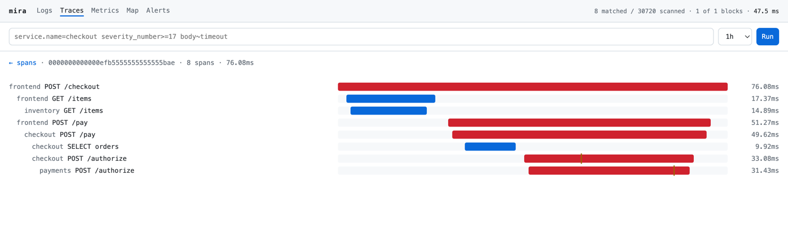

[](https://github.com/TrianaLab/mira/actions/workflows/ci.yml)
[](https://github.com/TrianaLab/mira/releases/latest)
[](https://artifacthub.io/packages/search?repo=mira)
[](docs/internals/testing.md)
[](https://github.com/TrianaLab/mira/blob/main/Cargo.toml)
[](LICENSE)

**Logs, traces and metrics in. A web UI, a terminal UI and an MCP server out.
One binary, no cluster, no sidecar, no database beside it.**

```sh
curl -fsSL https://miradb.dev/install.sh | bash
mira --data-dir ./data
```

Point any OTLP exporter at gRPC `4317` or HTTP `4318`, open
`http://localhost:4318/`, or point an agent at `POST /mcp`. The block directory
is the only state there is.



## The numbers

| | |
|---|---|
| **1,458,967 records/s** | ingest, on **1.78 of 12 cores** — 891k/s/core at one connection |
| **1.5 ms** | to prove a value is in **none** of 87 blocks, zero blocks opened |
| **13.3 ms** | every span of one trace, out of 28.8M spans on disk |
| **7 µs** | the durable log append inside an acknowledgement |
| **0.14** | bytes on disk per byte on the wire, once compacted |
| **5.62 MiB stripped, 117 crates** | `zstd-sys` is the only C dependency, and it vendors its source |

Apple M3 Pro, one process, reproducible with the load harness in this
repository. The full sweep:
**[end-to-end testing](docs/internals/e2e.md)**. Why they land there:
**[architecture section 11](docs/architecture.md#11-performance-model)**. How
they read against the market, including where Mira is behind:
**[docs/market.md](docs/market.md)**.

## Four surfaces, one read path

Same data, same filter grammar, same code underneath. Nothing to deploy for any
of them.

| | | |
|---|---|---|
| **Browser** | `http://localhost:4318/` | Served out of `include_bytes!`; the whole view lives in the URL, so an alert webhook links straight back into it. |
| **Terminal** | `mira mira` | The same views over a running replica — or over a block directory **with no server at all**. |
| **MCP** | `POST /mcp` | Eight tools, no session id, so any replica answers any call. |
| **HTTP** | `/api/v1/…` | `query`, `correlate`, `map`, `entities`, `metrics`, `alerts`. |

## See it

**[miradb.dev/demo](https://miradb.dev/demo/)** — one command, then six screens
of both UIs, from data you generated a minute earlier.

```sh
docker run -p 4317:4317 -p 4318:4318 -v mira-data:/data ghcr.io/trianalab/mira:latest
helm install mira oci://ghcr.io/trianalab/charts/mira
```

Linux glibc >= 2.34 and macOS, x86_64 and arm64. `--version v0.0.1` pins the
installer to a release; every one of them ships a CycloneDX SBOM, `SHA256SUMS`,
a cosign signature and a SLSA provenance attestation.

## Where to go next

| | |
|---|---|
| Install it properly, on Kubernetes or otherwise | **[docs/install.md](docs/install.md)** |
| First query, and what the `stats` object tells you | **[docs/quickstart.md](docs/quickstart.md)** |
| Connect an agent, and a worked investigation | **[docs/agents.md](docs/agents.md)** |
| Every flag and config key | **[docs/config.md](docs/config.md)** · **[CLI](docs/reference/cli.md)** |
| How it works, and why it is shaped this way | **[docs/architecture.md](docs/architecture.md)** |
| Why it exists at all | **[MANIFESTO.md](MANIFESTO.md)** |

## Scope

Mira is pre-1.0 and says so. Ingestion is allocation-lean rather than zero-copy
(*queries* are zero-copy); there is no cross-replica query fan-out; there is no
entity predicate and no block cache. The full list, with the reasoning, is
[architecture section 0.1](docs/architecture.md#01-what-is-not-true-yet).

## Contributing

Every gate CI runs is a target in the [`Makefile`](Makefile), and CI calls
nothing else:

```sh
make            # the target list
make check      # fmt, clippy, tests, rustdoc, UI, supply chain, drift, docs, coverage
```

Read [architecture section 0](docs/architecture.md#0-corrections-to-the-original-brief)
first if the change is structural — it lists the mechanisms that do not survive
contact with the formats, and re-proposing one is the most common way to waste
an afternoon. [CONTRIBUTING.md](CONTRIBUTING.md) is the walkthrough, with
[the test levels](docs/internals/testing.md) and
[how a release is cut](docs/internals/releases.md) behind it. Vulnerabilities go
to [SECURITY.md](SECURITY.md), not to an issue.

## Licence

Apache-2.0.
