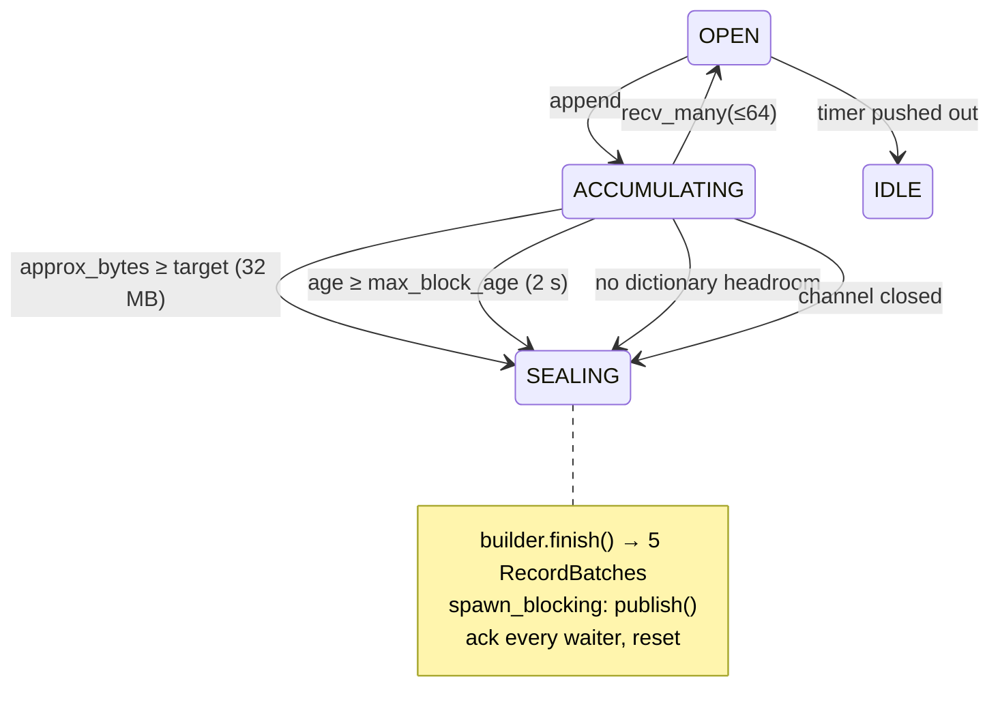

# 5. Flusher state machine

One task per shard, one open block each, three transitions:

Four details that are easy to get wrong:

- The age clock starts at the **first job of a block**, not the last flush, so
  latency is bounded from when data showed up.
- The timer must not reset its own deadline before the age check reads it, or a
  block never flushes and its client hangs forever.
- **A `UInt16` dictionary filling up is a seal trigger, not an error.** The check
  is `has_headroom_for(&req)` *before* the append, because an Arrow builder
  cannot be rolled back: an overflow discovered mid-append leaves a half-written
  row that fails `RecordBatch::try_new` at every subsequent flush. Deferred
  requests go into the next block and keep arrival order.
- **A failed `finish()` replaces the builder.** `finish` resets column builders as
  it goes, so a failure part way through leaves one that can never seal again,
  and a node that rejects everything until restarted.

Accumulation lives in Arrow's typed builders, not a `Vec<RecordBatch>`
concatenated at flush: `RecordBatch` is immutable and has no append, and
`concat_batches` costs 2× peak memory for the duration, a footprint regression on
one of the four axes. `ArrayBuilder::finish_cloned` gives the open-block read
surface (section 4) a snapshot for one buffer copy per column.

**Blocking work never runs on a runtime worker.** `publish` fsyncs, and a cold
mmap read takes a hard page fault that stalls the whole OS thread with no signal
to tokio; both go through `spawn_blocking`.

---
