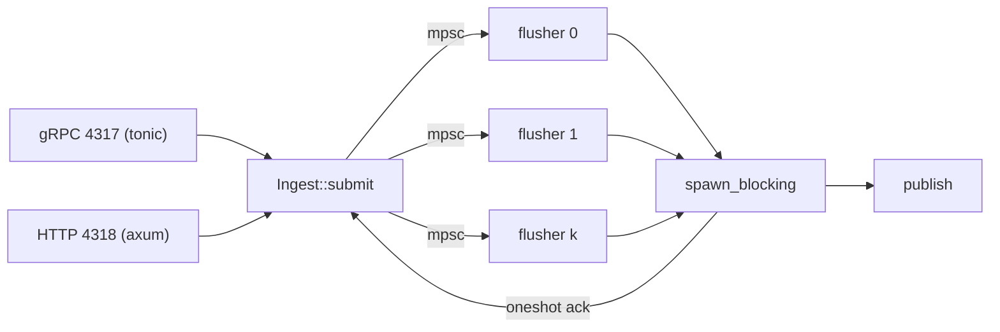

# 4. Ingest path

## gzip on both listeners

Both of the collector's OTLP exporters compress by default, so a receiver that
speaks only plain bodies rejects the first batch of every stock deployment.
Worse, protobuf fed a gzip stream is a `400 invalid wire type`, which OTLP
classes as permanent, so the exporter drops the data rather than retrying.
4317 is `accept_compressed(Gzip)`; 4318 reads `Content-Encoding` and inflates
before it decodes, answering an encoding it does not implement with `415`.

## One size limit, applied three times

`ingest.max_request_bytes` binds axum's `DefaultBodyLimit` on 4318, tonic's
`max_decoding_message_size` on 4317, and the ceiling on what a gzip body may
inflate to: a limit on what *arrives* would not bind under gzip, where a few
kilobytes of zeros outgrow any memory the process has. The cap is absolute,
not a ratio: a real OTLP batch, the same attribute keys over and over, reaches
about 35:1.

One *number* rather than one per transport: a batch that works on 4317 and fails
on 4318 is a bug that depends on a transport nobody changed. The default is
16 MiB, and both error messages say the same fix — raise this number or lower
the sender's batch size.

## Admission parks, and does not shed

`submit` tries `try_reserve` on every shard before it waits anywhere, and waits
only when all are full: `ADMIT_WAIT`, five seconds, on one shard picked by a
turn counter, so parked waiters wake as each queue drains. A timeout, and only a
timeout, returns `UNAVAILABLE` with `RetryInfo(250ms)`.

The first revision shed on a full queue, for a fast NACK. `ADMIT_WAIT` bounds
the tail that argued for it, and the NACK is not fast: tonic and axum decode the
request before the handler is called, so the export's expensive part is already
paid when `submit` runs, and shedding throws it away for a client that sends the
same bytes a second later (section 11 has the A/B). Parking is bounded by the
connection count; a deeper queue is bounded by nothing.

## Acknowledged means published

The export is acknowledged **only after the block directory rename is durable**.
OTLP's retryable status set covers exports in flight at a crash; acking earlier
is the one window in which data is lost while the client believes it stored.
Because that latency would otherwise be bounded by the caller's own traffic,
`max_block_age` (2 s) is a flush trigger alongside size.

## No WAL

Publish is write-tmp, fsync files, fsync tmpdir, rename dir, fsync parent, fsync
grandparent. That last one is not belt and braces: fsyncing a directory
persists the entries *inside* it, not the entry naming it in its own parent, and
the first block of every hour creates the partition directory it lands in, so
with only the parent fsynced the ack is a lie. No filesystem promises anything
about ancestors, and the extra fsync is cheap. Directory rename is atomic on
POSIX, so a block is either wholly visible or wholly absent: no torn state,
nothing for recovery to replay. Recovery is `scan()`, the `readdir` the read
path already does; the sequence counter resumes from the highest published
block.

## A log anyway, for latency, not for recovery

`ingest.wal` does not contradict the section above: there is still no torn
state, and nothing to replay. What it buys is the *ack*, which under
"Acknowledged means published" costs 2.6 s at p99 (section 11) because the
export waits for its block to fill or age out, and a smaller block would only
move the cost to the read path. So the frame goes to `.wal/` first, the ack
costs a `write(2)` at 7 µs p50, and publish becomes a background reorganisation
of data already on disk.

The log tracks not a high-water mark but a *set*: every sequence handed out and
not yet published, in `Wal::pending`, read by `watermark_for` (section 9).
`Wal::append_then` enqueues inside the log's own mutex, so a frame is in that
set before any shard can publish past it, and a replayed frame keeps its own
sequence rather than becoming a copy numbered above every watermark.

## Read-your-writes without a coordinator

What makes `OpenSlot::fresh` exact is an ordering the pipeline already had:
`submit` acknowledges an export only after the job is in the flusher's channel,
so *every acknowledged export is queued ahead of any request issued after it*. A
reader needs no counter, clock or watermark: it sends a request down a side
channel, the flusher answers only on a turn where both channels are empty, and
FIFO does the rest. The answer carries the `(node, seq)` the block *will*
publish under, and that is the dedupe rule: `block::sources` drops a snapshot
once a directory with the same pair appears.

The snapshot starts at row zero in publish order, so row `n` of it is row `n` of
the eventual block and a cursor over open data stays valid across the seal. The
sidecars are deliberately *not* built for it: an open block is always scanned
anyway, so a filter that will only ever answer "yes" is pure waste.

## Sharding, and what a shard may be keyed on

The unit is the core, not the resource hash. Resource cardinality in real fleets
is bimodal: a handful of huge resources carrying 90% of volume, plus a long
near-idle tail, so hash sharding gives a permanently hot shard *and* a
small-file explosion in the tail.

Each signal runs `ingest.shards` flushers, defaulting to *cores ÷ 2* and capped
at 16. Halved because a flusher is a **consumer**: the protobuf decode and the
runtime's own work are the producers, and giving every core a flusher leaves
nothing to feed them. The knob exists because `available_parallelism` reads a
cgroup CPU *quota*, but not `cpu.shares` or a pod with no quota on a 96-core
node.

### Five things had to move

- **Dispatch is first fit from shard 0, not round-robin.** `Ingest::reserve`
  takes the first `try_reserve` that succeeds, so a lightly loaded node still
  produces one block per seal window, not `shards` nearly-empty ones.
  Ordering *within* a shard is preserved, which section 5's carry rule needs;
  across shards it is not.
- **The sequence space is partitioned by stride, not by an allocator.** Shard
  *k* takes `resume + k`, `resume + k + shards`, and so on; the next restart's
  `resume` is above every stride. It is scanned once, in `spawn`, so no shard
  can land on a sibling's stride.
- **The WAL watermark stopped being `max(seq) + 1`.** Shards seal out of order,
  so a block claims the oldest sequence of its signal that nobody has published
  and that is not in this block; section 9 has the protocol.
- **`ingest.queue` became a total, not a depth.** Each shard gets
  `queue.div_ceil(shards)`, so raising the shard count does not multiply the
  worst-case resident cost.
- **Health counters became per shard.** `open_since` and `stalled_since` are the
  *oldest non-zero* of the shards': one aggregate would let a shard sealing
  normally clear a sibling's clock.

### Read-your-writes survives the shards

An acknowledged export is in exactly one shard's channel until that shard
appends it, and each shard answers a `fresh` request only on a turn where both
its channels are empty. `OpenSlot::fresh` sends every ask before awaiting any
answer, or a flusher's backlog would sit between one answer and the next.

## Decoder affinity, when OTAP lands

OTAP section 4.4 mandates decoder state per (gRPC stream, payload_type,
schema_id), strictly ordered: connection-affine by construction. The receiver
will decode on the per-connection task and push `Arc`'d Arrow buffers onward,
another reason the "one global lock-free ring buffer" shape was wrong.

---
