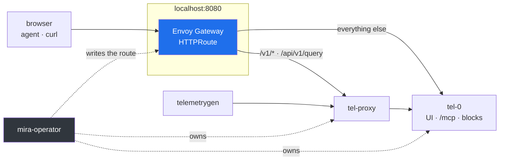

# See it on Kubernetes

**For:** anyone who will run Mira in a cluster and wants to see the operator, the
proxy and a real ingress carrying it. One command, a few minutes, and it leaves
everything running.

```sh
make demo-cluster
```

It needs `docker`, `kind`, `kubectl` and `helm`.

[See it work](demo.md) is the same product without any of this, and it is
quicker. Start there if the question is what Mira does; this one answers what it
looks like once Kubernetes is in front of it.

## What it builds

A one-node [Kind](https://kind.sigs.k8s.io/) cluster with the node's 30080
forwarded to the host's 8080, then, in order: Envoy Gateway, the operator from
`charts/mira-operator`, a `Gateway`, a `MiraCluster` of one storage replica and
one proxy, and `telemetrygen` exporting into the proxy for as long as the
cluster lives. Last, it seeds an hour of a four-service shop through the
Gateway from the host — the same generator `make demo` uses, so there is
something worth asking questions about before the live traffic has accumulated
any.

Nothing has to stay in the foreground. `make demo-cluster-down` deletes the
cluster, which is all of it.

## The shape of it



The operator writes that `HTTPRoute`, from four lines of `spec.route` naming the
Gateway — see [the CRD reference](reference/crd.md). The split is not a demo
choice and not configurable: `/v1/*` is OTLP ingest and `/api/v1/query` is the
read a proxy can merge, so both go to the proxy, and the UI, `/mcp` and the
reads built by walking one node's blocks live on a storage node, so everything
else goes there.

That split is also why the demo runs one storage replica. With two, the browser
would be reading half the corpus while the query API read all of it.
`make operator-e2e` is where the multi-replica tier is exercised.

## What to do with it

| | |
| --- | --- |
| UI | `http://localhost:8080/` |
| Terminal UI | `target/release/mira mira --addr localhost:8080` |
| An agent | `claude mcp add --transport http mira http://localhost:8080/mcp` |
| What is stored | `curl -s http://localhost:8080/api/v1/stats` |
| The objects | `kubectl --context kind-mira-demo -n mira-demo get miracluster,sts,deploy,svc,httproute` |

With the agent connected, ask it *which service is failing checkouts, and why* —
it has [eight tools](agents.md) against the same blocks the UI is reading.

A query enters where everything else does:

```sh
curl -s http://localhost:8080/api/v1/query -H content-type:application/json \
  -d '{"signal":"traces","where":[{"attr":"exception.type","eq":"payments.CardDeclined"}],"limit":3}'
```

## Next

- [Install](install.md) — the chart, the image and the flags for a real cluster
- [Connect an agent](agents.md) — what the MCP tools do and how to ask well
- [MiraCluster CRD](reference/crd.md) — every field the operator reads
