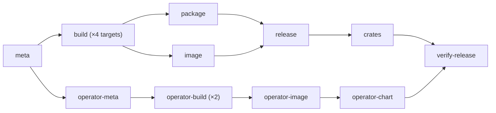

# Release architecture

**For:** whoever is cutting the next release, and anyone reviewing a change to
`.github/workflows/release.yml`. To *install* Mira rather than publish it, see
[Install](../install.md).

## One binary, one number

Mira publishes three coordinates and they all carry the same version string:

| Coordinate | Where |
| --- | --- |
| Tarballs, SBOM, `SHA256SUMS` | GitHub Release assets on the `vX.Y.Z` tag |
| Multi-arch image | `ghcr.io/trianalab/mira:X.Y.Z` (and `:latest`) |
| Three crates | `miradb`, `miradb-core`, `miradb-proto` on crates.io |

Nothing is computed at release time: the number was decided on a pull request,
written into `Cargo.toml` by a bot and checked by `make drift`.

No chart is on that list: `charts/mira` was removed when the operator landed.

### And two that do not

The operator is a separate program in a separate workspace, publishing two more
coordinates on a **version of its own**:

| Coordinate | Where | Version from |
| --- | --- | --- |
| Multi-arch image | `ghcr.io/trianalab/mira-operator:A.B.C` (no `:latest`) | `charts/mira-operator/Chart.yaml` |
| Helm chart | `ghcr.io/trianalab/charts/mira-operator:A.B.C` | the same file |

Built and pushed by the same `release.yml`, on the same tag, and that is all
they share with the four above. Three consequences:

| | |
| --- | --- |
| **The operator does not take the engine's number.** | A controller at `0.3.1` and an engine at `0.3.1` would claim they move together, and they do not: `spec.image` in a `MiraCluster` names whatever engine tag you want, including an older one, which is the entire point of a controller that upgrades a tier. A shared number would make "which operator supports which engine" a question whose answer looks obvious and is wrong. So `make bump` does **not** touch `charts/mira-operator/Chart.yaml`; `make drift` *does* check it, against a source of its own in a table of its own. |
| **Its publishers skip rather than fail**, the exact inverse of the rule in [Two irreversible facts](#two-irreversible-facts). | The engine's publishers refuse an existing coordinate because a tag that already exists means something went wrong; the operator's already exist on almost every release, since its number only moves when *it* changes. So `operator-image` and `operator-chart` each ask the registry first and exit with a `::notice::` if the coordinate is there. The engine's rule here would make every engine release red. |
| **So `verify-release` checks them unconditionally.** | A publisher that skipped and a publisher that broke look identical from the outside. The terminal job resolves both operator coordinates by digest, cosign-verifies both against the `release.yml@refs/tags/` identity, and asserts that `helm template` on the published chart names the published image tag — every run, including the runs where neither was pushed. |

The ceiling: **the operator cannot ship a fix without an engine release**. The
upgrade path is a `mira-operator/vA.B.C` tag and a second `push: tags:` filter
beside the existing one.

## Cutting a release

1. **Declare the line on the change itself.**

   ```sh
   make changeset
   ```

   It asks which of `@mira/engine` and `@mira/operator` this touches and whether
   it is major, minor or patch. Commit the file it writes under `.changeset/`
   with the change. `make ci-changeset` fails a pull request that touches
   shipped code without one; docs, tests, CI-only diffs and a hand-written bump
   are exempt.
2. **For an engine change, write the changelog section** under `## [Unreleased]`
   in `CHANGELOG.md`, which the release job extracts verbatim as the Release
   notes. An empty one degrades to `--generate-notes`, and `ci-changeset`
   refuses an engine changeset with one.
3. **Merge.** The push to `main` runs `version-packages.yml`, which opens or
   updates a **`chore: version packages`** pull request: it consumes every
   pending changeset, moves whichever of the two numbers they name and rewrites
   every site that restates them.
4. **Approve its held workflows, then merge it.** Merging is the release.
5. **Watch `verify-release`**, the terminal job.

`make bump TO=X.Y.Z && make drift` is the escape hatch: it writes the engine's
sites by hand, and only the engine's, for when the number has to be a specific
one.

There is no tag step. `ci.yml`'s `tag` job runs on every push to `main`,
downstream of both required contexts, and `scripts/tag-release.sh` pushes
`vX.Y.Z` unless `Cargo.toml`'s version already has a tag.

### Why the tag is dispatched and not just pushed

A tag pushed with `GITHUB_TOKEN` does **not** start a workflow — GitHub's loop
protection, whose only exempt events are `workflow_dispatch` and
`repository_dispatch`. So `tag-release.sh` pushes the tag and then runs `gh
workflow run release.yml --ref vX.Y.Z`.

Dispatching *at the tag* is about the OIDC subject: `meta` branches on
`GITHUB_REF_TYPE`, so the certificate identity is still
`release.yml@refs/tags/vX.Y.Z`, which is what `verify-release` pins.

The other exemption is partial: a pull request opened with `GITHUB_TOKEN` *does*
create the `pull_request` runs, but holds them, so somebody with write access
clicks **Approve workflows to run** in the merge box. Until then the required
contexts have not reported — the symptom is a Version PR with no checks, not a
red one. Skipping that click is all a PAT would buy.

`meta` fails the run before anything builds if the tag and `Cargo.toml`
disagree, because `mira --version` prints `CARGO_PKG_VERSION` and a hand-pushed
tag is still a tag.

A tag with a suffix — `v0.2.0-rc.1` — is marked a GitHub prerelease and a plain
`vX.Y.Z` is not, including while Mira is pre-1.0: `releases/latest` excludes
prereleases, and that is what `scripts/get-mira.sh` resolves without
`--version`.

## Two irreversible facts

**A published coordinate is immutable.** Every publisher asks the registry
whether the coordinate already exists and refuses rather than overwriting it, so
a re-run of a tag that partly published is a *red run*. Recovery is a version
bump — never a retag, never a force-push.

**`:latest` moves on the image.** Once an image push has happened,
`ghcr.io/trianalab/mira:latest` points at it whether or not the Release was
created, and the only unwinding is a newer version.

Both are why `concurrency` here is deliberately **not** `cancel-in-progress`: a
cancelled release is a half-published one.

## The job graph

Every job `needs: meta`, and every job is in `verify-release`'s `needs` closure —
`make workflows` enforces that statically, so a publisher that silently skips is
caught at PR time.



Two chains, one terminal job: a broken operator build does not stop the engine
from releasing. `operator-chart` is downstream of `operator-image` because a
chart pointing at an image that failed to push is a green run and a broken `helm
install`.

| Job | What it does, and why |
| --- | --- |
| `meta` | Computes `version`, `publish` and `prerelease` once. Deriving them per job is how a release ends up tagged `v0.2.0` with a binary that prints `0.1.0`. |
| `build` | A four-way matrix: `{x86_64,aarch64}-unknown-linux-gnu` on `ubuntu-22.04` / `ubuntu-22.04-arm`, `{x86_64,aarch64}-apple-darwin` on `macos-15`. The Ubuntu images are pinned to 22.04 rather than `-latest` because that is the GLIBC_2.34 floor the README promises; `make glibc-floor` asserts it on the built binary. Each leg runs `make dist-tarball`; the x86_64 Linux leg also runs `make dist-sbom`. |
| `package` | Merges the artifacts, runs `make dist-sums`, and raises one SLSA provenance attestation over `dist/SHA256SUMS` — so every tarball and the SBOM are subjects of it transitively, at the cost of one attestation instead of six. |
| `image` | Untars the two Linux binaries into `dist/linux/{amd64,arm64}/mira` and builds with `BIN=prebuilt`, so neither stage runs a command and a `linux/amd64,linux/arm64` build is buildx copying files the host already has — no QEMU. It refuses an existing coordinate *before* pushing, because `gh release create` would only refuse the duplicate after `:latest` had already moved. |
| `release` | Calls `gh release create`. `gh` is preinstalled on the runner and does exactly this, so there is no third-party release action holding a write token. |
| `crates` | Runs `make publish` — `cargo publish --workspace`, which works the order out of the dependency graph and waits for the index to serve each member before building the next. It is last because it is the least reversible thing the workflow does: a ghcr tag can be overwritten and a GitHub Release deleted, but a crates.io version is consumed on upload and `cargo yank` only hides it. It needs a `CARGO_REGISTRY_TOKEN` secret and fails with a message naming it if it is missing — everything else has already published by then, so the fix is to re-run the job, not to bump. |
| `operator-meta` | Reads the three version fields out of `charts/mira-operator/Chart.yaml` — `version`, `appVersion` and the tag in the `artifacthub.io/images` annotation — and **fails if any disagrees**. `make drift` checks the same three on every pull request; this stayed because it is the only check that runs on the commit the tag actually names. The chart installs a Deployment whose image tag defaults to `appVersion`, so a chart at `0.2.0` carrying `appVersion: 0.1.0` ships a controller one version behind the CRD schema it was installed with. The annotation is worse in a quieter way: nothing renders it, so a stale one is Artifact Hub scanning the previous image for CVEs and reporting them on this release's page. |
| `operator-build` | Two native runners, `ubuntu-22.04` and `ubuntu-22.04-arm`, pushing by digest — not one buildx pass over `linux/amd64,linux/arm64`. `image` can do that because it copies prebuilt binaries and never runs a command in the build; the operator's Dockerfile *compiles*, so the same trick would emulate a 160-crate Rust build under QEMU. A matrix job cannot write per-leg `outputs` (last writer wins), so each leg uploads its digest as an artifact named after its arch, and `operator-image` joins them with `docker buildx imagetools create`, which writes an index over manifests already in the registry and uploads nothing. A dry run still builds both architectures, with `outputs: type=cacheonly`: the half of this that can be wrong is the compile. |
| `operator-image` and `operator-chart` | Each begins with a `free` step that asks the registry whether the coordinate exists and **skips the rest of the job** if it does. See [And two that do not](#and-two-that-do-not) for why that is the opposite of every other publisher here. |
| `operator-chart` | Passes **no** `--version`/`--app-version` to `helm package`: the numbers in `Chart.yaml` *are* the release, and `operator-meta` has already asserted they agree. It is also where the `:artifacthub.io` OCI artifact is pushed — the repository-ownership proof Artifact Hub looks for — and that push is deliberately *outside* the skip: the tag is mutable, one repository has one proof, and re-pushing identical bytes is free. |
| `verify-release` | Throws away every artifact and output the run produced, checks out nothing, re-downloads what a stranger would download, and verifies it with the same commands [Install](../install.md) tells a stranger to run. Its first step is the only one that does *not* authenticate, and it is there for the trap below. |

## A package's first push is private

GitHub creates a `ghcr.io` package private, and the release that first publishes
a coordinate is the release that creates it. Visibility is a package setting
with no API.

So v0.0.1 published an image and a chart nobody could pull, on a green run:
every step that touched the registry had logged in first.

`verify-release` now asks for an anonymous pull token before it authenticates,
for all three coordinates, and fails the release if any is refused. The fix is
the package's own settings page rather than a version bump.

The crates are checked the same way, against `index.crates.io` — the sparse
index Cargo itself resolves against, not the API.

## What is signed, and what is not

| Artifact | Checksummed | Cosign | SLSA provenance |
| --- | --- | --- | --- |
| Release tarballs | `SHA256SUMS` | — | via `SHA256SUMS` |
| CycloneDX SBOM | `SHA256SUMS` | — | via `SHA256SUMS` |
| `SHA256SUMS` itself | — | — | yes, directly |
| Image (`mira:X.Y.Z`) | digest | yes, over the digest | yes, pushed to the registry |
| crates (`miradb*`) | registry `.crate` checksum | — | — |
| Image (`mira-operator:A.B.C`) | digest | yes, over the digest | yes, pushed to the registry |
| Chart (`charts/mira-operator:A.B.C`) | digest | yes, over the digest | — |
| `:artifacthub.io` metadata | — | — | — |

**Everything signed is signed over its digest, never over a tag**, which is a
mutable pointer.

The image signature is written in the legacy `.sig`-tag layout
(`--new-bundle-format=false --use-signing-config=false`) rather than as an OCI
referrer, because Artifact Hub does not read referrers.

`verify-release` re-runs `gh attestation verify` and all three `cosign verify`
calls with the identity pinned to `release.yml@refs/tags/`, so a signature
raised by any other workflow, or on any other ref, fails the release.

## Where the version lives

**The engine.** `Cargo.toml`'s `[workspace.package] version` is the source;
everything below restates it.

| Site | Written by | Gate |
| --- | --- | --- |
| `Cargo.toml` `[workspace.package]` | `make bump` | the source |
| `Cargo.toml` `miradb-core` / `miradb-proto` path-dep pins | `make bump` | `make drift` |
| `docs/install.md` — `--version v`, `V=`, the `spec.image` in the MiraCluster | `make bump` | `make drift` |
| `README.md` — `--version v` | `make bump` | `make drift` |
| `SECURITY.md` — the supported-versions line | `make bump` | `make drift` |
| `.github/ISSUE_TEMPLATE/bug_report.yml` — the `mira X.Y.Z` placeholder | `make bump` | `make drift` |
| `charts/mira-operator/README.md.gotmpl` — the `spec.image` in the MiraCluster | `make bump` | `make drift` |
| `CHANGELOG.md` — the heading and the link definitions | `make bump` | **none** (prose) |
| `release/units/mira-engine/package.json` — the changeset unit | `changeset version` | `make drift` |
| `Cargo.lock` | `cargo update --workspace` | `--locked` fails the build |
| `charts/mira-operator/README.md` | `make bump`, then `helm-docs` over it | `make helm-docs-check`, `make drift` |

**The operator.** `release/units/mira-operator/package.json` is the source and
`charts/mira-operator/Chart.yaml` follows it. Every row here is written by `xtask
release apply` and gated by `make drift`:

| Site |
| --- |
| `charts/mira-operator/Chart.yaml` — `version`, `appVersion`, and the tag in the `artifacthub.io/images` annotation |
| `integrations/kubernetes/Cargo.toml` — `[package] version` |
| `integrations/kubernetes/Cargo.lock` — the `mira-operator` entry (regenerated, checked anyway: `--locked` is what turns a stale one into a red release) |
| `docs/install.md` — `helm install --version`, and the `ghcr.io/trianalab/charts/mira-operator:` pull |

`make version` writes both tables and regenerates the derived files. The writer
and the gate are one table of anchored patterns — `version_sites()` in
`crates/xtask/src/drift.rs` and `operator_sites()` in
`crates/xtask/src/release.rs` — read forwards to check and backwards to write.
Anchored, because this page names past releases on purpose; a pattern matching
*nothing* is a failure rather than a pass.

`CHANGELOG.md` is the one site still ungated. `make bump` promotes
`## [Unreleased]` to `## [X.Y.Z]`, opens a fresh empty one, moves the link
definitions, and **refuses** if `## [Unreleased]` is empty.

## What the tag path does not re-run

A tag push triggers `release.yml` only — no tests, no clippy and no `make drift`
on the release path.

This is survivable because the `tag` job `needs: [required, security-required]`,
so the commit a tag names is the commit both gates just passed on. The residual
hole is a hand-pushed tag, the one way to reach `release.yml` from a commit no
gate has seen.

## Rehearsal, and what only the tag can run

`ci.yml`'s `release-dry-run` leg runs `make dist` and `make publish-dry` on every
code PR — the real tarball, SBOM and checksum targets, then a full `cargo publish
--workspace` stopping at the upload. `workflow_dispatch` **at a branch** runs the
whole DAG with `publish=false`.

The operator's four jobs are the weakest here: `operator-build` compiles both
architectures on a dry run and `operator-meta` runs unconditionally, but
`operator-image` and `operator-chart` are gated on `publish`, so the `free`
check, `imagetools create`, both `cosign sign` calls and the `helm push` digest
scrape have **never executed**.

The `crates` job's upload is unrehearsable by construction, so every release
still trusts a step only the tag can run. `verify-release` fails loudly when it
is wrong, and recovery is a bump to the next patch.
